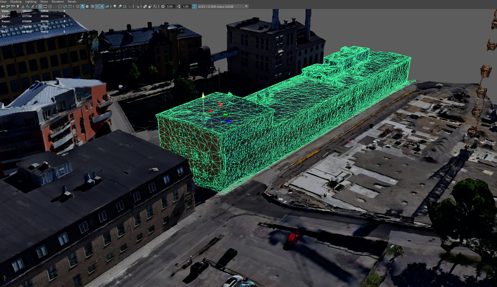

# polySelector
Maya plugin that selects an area  of polygons from target polygons  

## Issue
Scanned (photogrammetry) 3d models is not fun to model, so-called Non-manifold meshes. The polygons are not necessarily connected, edges lacks of connected faces and the shortest edge path algorithm will not cover very long distances. Therefore, you will encounter difficulties in selecting desired parts from your mesh. 
But you're in luck. Meshlab has a fantastic tool to simplify and reconstruct your mesh to be able to edit it more easily in a modeling software. With that done you can use my polyselector python plugin to extract a component/part/building from the mesh.

## Instructions:

* First of all, start by importing the scanned mesh into Meshlab, select filters, Reconstruction, Simplification and Reconstruction. Select Surface Reconstruction: Ball Pivoting. Increase the world unit by clicking the up arrow on time (225.09) and Apply. (the process will not destroy the mesh's uv coordinates).

* Export your reconstructed mesh and import it into Maya.

* Use the Multi-cut tool to cut out the part of the mesh you want to extract (this tool works best for manifold meshes).

* Mark the edges that have cut out of your part so that it is "circled".

* Click Multi-component so you can also select a center polygon, select a polygon in the center of your area.

* Read the python script, type `run()` in the terminal and click execute.

* Now all polygons are marked in the area

* Select extract in edit Mesh and now your part is separated from the mesh

### Non-manifold mesh:


### Shortest edge path issue:


### Multi-Cut tool in reconstructed mesh:


### Selected vertecies border:


### Selected polygons of the building:


### Extracted building ✂🏠✅:


## Dubgging
Copy the python script file to: `C:\Users\myUser\Documents\maya\2022\scripts`

Create a new python launch.json file i VS code:
```
{
  "version": "0.2.0",
  "configurations": [
    {
      "name": "Python Attach",
      "type": "python",
      "request": "attach",
      "port": 5678,
      "host": "127.0.0.1",
    }
  ]
}
```

Open the script editor in Maya. Open a new python terminal. Copy, pase and execute:

```
import os
import debugpy
mayapy_exe = os.path.join(os.environ.get("MAYA_LOCATION"), "bin", "mayapy")
debugpy.configure(python=mayapy_exe)
debugpy.listen(5678)
```

Start the debugger in VS code. And place a brakepoint.
To run the polyselector script. In the python terminal. Copy, pase and execute:

```
import polySelector
polySelector.run()

import importlib
importlib.reload(polySelector)
```

If the debugger dose not stops att the brakepoint, try to restart maya and execute the scripts again.

